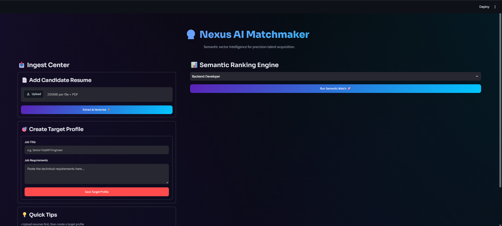
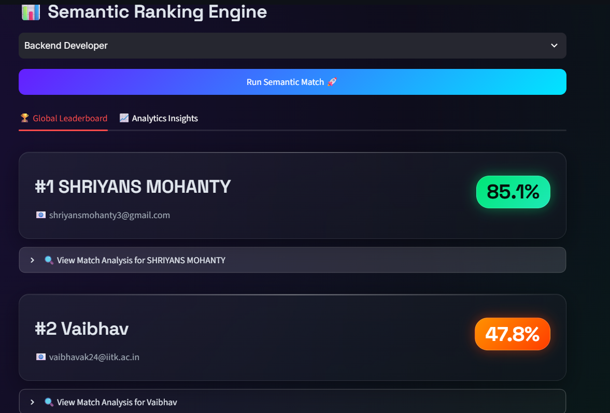
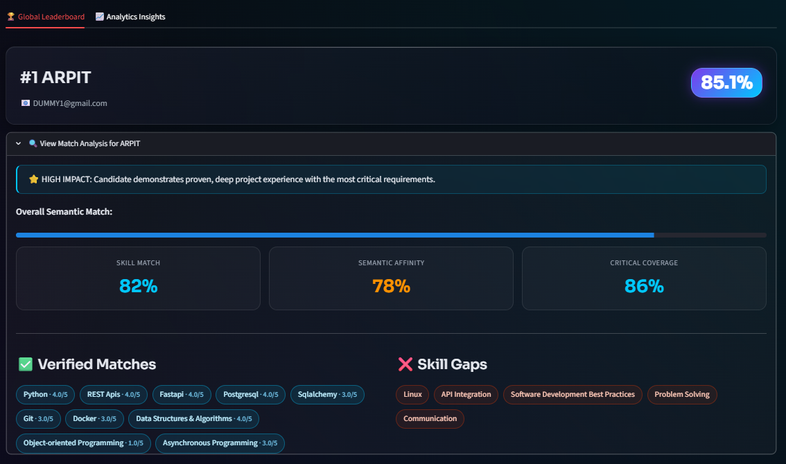
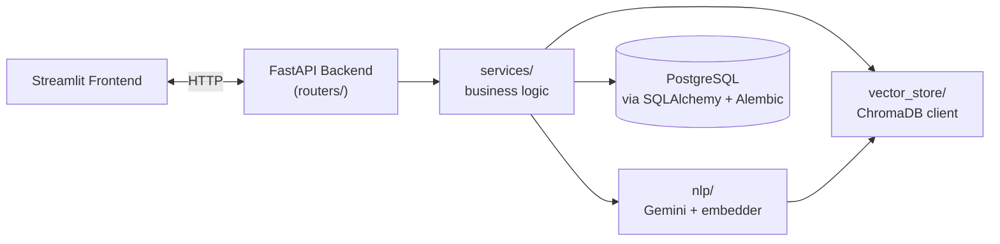

# AI-Powered Resume Intelligence Platform

A containerized, full-stack Applicant Tracking System (ATS) that leverages a custom Two-Pass LLM architecture and hybrid vector search to perform highly accurate, evidence-backed candidate matching.

Traditional ATS platforms rely on rigid keyword matching, leading to "keyword stuffing" exploits and missed talent. This platform solves that by utilizing a domain-agnostic, multi-layered AI pipeline that extracts literal skills, infers semantic proficiencies, and ranks candidates against job descriptions using 384-dimensional vector embeddings.


## 📸 Preview







## 🚀 Key Features

* **Two-Pass LLM Extraction Pipeline:** Separates literal data scanning from semantic inference using Gemini 3.6 Flash. This mitigates LLM cognitive load and hallucination, generating evidence-backed proficiency scores (1–5) and neutralizing ATS keyword-stuffing exploits.
* **Domain-Agnostic Semantic Ranking:** Evaluates resumes across any industry by dynamically aligning candidate capabilities against LLM-extracted job priorities using ChromaDB vector retrieval (`all-MiniLM-L6-v2`) and a custom weighted scoring matrix.
* **Production-Grade Infrastructure:** Fully containerized with Docker Compose, integrating a FastAPI/PostgreSQL backend with a Streamlit frontend and seamless Alembic schema migrations across isolated database volumes.
* **Security & Reliability:** Implements strict JSON-schema constraints, prompt-level injection mitigation for untrusted PDF inputs, and deterministic regex fallbacks for PII extraction.
* **Highly Optimized Backend:** Profiled under 50 concurrent threads using `py-spy`. Diagnosed and resolved PostgreSQL connection-pool starvation to improve throughput by ~35% (21 → 28.5 RPS avg) while maintaining ~65ms single-request latency.

## 🛠️ Tech Stack

* **Frontend:** Streamlit
* **Backend:** FastAPI, Python, Uvicorn
* **Database & ORM:** PostgreSQL, SQLAlchemy, Alembic (Migrations)
* **AI & NLP:** Google Gemini 3.6 Flash, Sentence Transformers
* **Vector Store:** ChromaDB
* **DevOps & Profiling:** Docker, Docker Compose, py-spy

## 🏗️ Architecture Overview

The platform is a three-tier system: a Streamlit frontend, a FastAPI backend that owns all business logic, and two persistence layers (PostgreSQL for structured data, ChromaDB for vector search). The two-pass LLM pipeline is just one piece — end-to-end, a request flows through parsing, extraction, embedding, storage, and ranking stages that live in distinct service modules.

### System Diagram



### Flow 1 — Resume Upload

1. `routers/resume.py` receives the uploaded PDF.
2. `services/pdf_parser.py` extracts raw text from the file.
3. `nlp/extractor.py` runs the **Two-Pass LLM Pipeline** (literal extraction → semantic scoring) on that text.
4. `services/candidate_service.py` persists the structured candidate profile to PostgreSQL.
5. `nlp/embedder.py` converts the candidate's skill profile into a 384-dimensional vector.
6. That vector is written to ChromaDB (`vector_store/`), tagged with the candidate's ID for later retrieval.

### Flow 2 — Job Creation & Matching

1. `routers/jobs.py` receives a job title + requirements text.
2. `services/job_service.py` calls `nlp/extractor.py`'s JD parser, which returns a **weighted skill list** (each skill scored 1–5 on importance).
3. The weighted skills are stored alongside the job in PostgreSQL.
4. On a match request, `services/ranking_service.py`:
   - Embeds the job text and queries ChromaDB for a pool of semantically similar candidates.
   - Runs each candidate's stored skills against the job's weighted requirements using alias/category-aware skill matching (handles synonyms like `js` ↔ `javascript`, and hierarchical matches like `sqlalchemy` ↔ `orm`).
   - Combines skill-match score (80%) with raw vector similarity (20%) into a final ranked score, with an additional multiplier if critical (high-weight) skills are missing.
5. Results are returned to the frontend and (for the final top-K) persisted to a `Ranking` table for history.

### 🧠 Two-Pass LLM Pipeline (Extraction Detail)

To ensure high fidelity in data extraction, resumes are routed through two distinct AI phases:

1. **Pass 1 (Literal Extraction):** Scans the raw text with strict constraints to *only* extract explicit, literal skills and keywords. No inference or evaluation is allowed.
2. **Pass 2 (Semantic Inference & Scoring):** Feeds the literal list and original text back to the LLM to deduplicate terms, infer foundational skills based on context (e.g., inferring "Problem Solving" from high competitive programming ratings), and assign a 1–5 proficiency score backed by specific quoted achievements from the text.

### Data Layer

- **PostgreSQL** stores structured records — candidates, job descriptions, and rankings — managed through SQLAlchemy models (`backend/models/`) with schema changes tracked via Alembic migrations (`alembic/`).
- **ChromaDB** stores the 384-dimensional embeddings used for semantic similarity search, kept separate from PostgreSQL since vector similarity queries and relational queries have very different access patterns.

## 📁 Project Structure

```
.
├── alembic/                  # Database migration scripts (Alembic)
├── alembic.ini                # Alembic configuration
├── assets/                    # README images/screenshots
├── backend/
│   ├── main.py                 # FastAPI app entrypoint
│   ├── db/
│   │   └── session.py           # DB session/engine setup
│   ├── models/
│   │   └── models.py            # SQLAlchemy ORM models (Candidate, JobDescription, Ranking)
│   ├── routers/
│   │   ├── jobs.py               # /api/jobs endpoints
│   │   └── resume.py             # /api/resumes endpoints
│   ├── schemas/
│   │   └── schemas.py            # Pydantic request/response models
│   └── services/
│       ├── candidate_service.py  # Candidate persistence logic
│       ├── job_service.py        # Job persistence + JD parsing trigger
│       ├── pdf_parser.py         # PDF to raw text extraction
│       └── ranking_service.py    # Dynamic weighted skill-matching engine
├── chroma_db/                 # Persisted ChromaDB vector store (Docker volume)
├── frontend/
│   └── frontend_app.py         # Streamlit UI
├── nlp/
│   ├── embedder.py              # Sentence-Transformers embedding wrapper
│   └── extractor.py             # Two-pass Gemini extraction + JD parsing
├── scripts/
│   └── backfill_vectors.py     # One-off script to re-embed existing candidates
├── tests/                     # Test suite
├── vector_store/               # ChromaDB client wrapper
├── Dockerfile.backend
├── Dockerfile.frontend
├── docker-compose.yml
├── requirements.txt            # Backend dependencies
├── requirements-frontend.txt   # Frontend dependencies
├── LICENSE
└── README.md
```


## 🚦 Getting Started

### Prerequisites
* [Docker Desktop](https://www.docker.com/products/docker-desktop/) installed and running.
* A [Google Gemini API Key](https://aistudio.google.com/).

### 1. Clone the Repository
```bash
git clone https://github.com/AIResumeLabs/ai-resume-platform.git
cd ai-resume-platform
```

### 2. Configure Environment Variables

Create a `.env` file in the root directory and add your Gemini API key. The database URL is pre-configured for the Docker network.

```text
GEMINI_API_KEY=your_gemini_api_key_here
DATABASE_URL=postgresql://postgres:postgrespassword@db:5432/resume_matcher_db
```

### 3. Launch the Application

Build and start the entire stack (Frontend, Backend, and Database) using Docker Compose.

```bash
docker compose up --build
```

*(To run in the background, append `-d` to the command).*

### 4. Access the Platform

Once the containers are running, the platform is available at the following local endpoints:

* **Web UI (Streamlit):** http://localhost:8501
* **API Documentation (Swagger UI):** http://localhost:8000/docs
* **Database (External Access):** `localhost:5433` (Username: `postgres`, Password: `postgrespassword`)

## 🧠 Architecture Deep-Dive: The Two-Pass Pipeline

To ensure high fidelity in data extraction, the system routes resumes through two distinct AI processing phases:

1. **Pass 1 (Literal Extraction):** Scans the raw text with strict constraints to *only* extract explicit, literal skills and keywords. No inference or evaluation is allowed.
2. **Pass 2 (Semantic Inference & Scoring):** Feeds the literal list and original text back to the LLM to deduplicate terms, infer foundational skills based on context (e.g., inferring "Problem Solving" from high competitive programming ratings), and assign a 1-5 proficiency score backed by specific quoted achievements from the text.

## 🤝 Contributing

Contributions, issues, and feature requests are welcome. Feel free to open an issue or submit a Pull Request.

## 📝 License

This project is licensed under the [MIT License](LICENSE).
